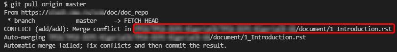
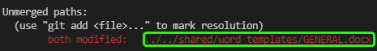

# How to Resolve a Merge Conflict

> This article explains how to resolve merge conflicts by using Visual Studio Code. The instructions are designed for beginners.
>
{style="note"}

A merge conflict occurs when you attempt to merge two branches, and they both contain changes in the same line of the same file.

When you create a pull request for such branches in the web interface, you will see a warning that this pull request cannot be merged because of the conflicts:


## Finding the conflicting file

> In this article, we will use the following terms:
>
>*  **source branch**—the branch you want merge (for example, a user branch or a bugfix branch)
>
>*  **destination branch**—the branch you want to merge into (for example, the main branch)

To find out, which file is conflicting, go to your local repository and run the following commands:

```
git checkout <source branch>
git pull origin <destination branch>
```

You will get a message with the name of the conflicting file.

That can be a binary or a text file:


*Merge conflict in a binary file*



*Merge conflict in a text file*

To resolve the conflict, perform the steps described in the following sections, depending on the type of the conflicting file.

## Merge conflict in a binary file

*To resolve a merge conflict in a binary file:*

1. Copy the conflicting file to any location outside the repository.

   We will further refer to this copy as the **backup version**.

1. Run ``git status`` and copy the path to the conflicting file:

   

1. Run the following command:

    ```
    git checkout --theirs -- <path to the conflicting file>
    ```

   For example:

   

   The file from the **destination branch** will be saved, and the file from the **source branch** will be ignored (but we will still have the backup version from step 1).

1. Run the following commands:
    
   ```
   git commit -m "Resolved merge conflict"
   git push origin HEAD
   ```

1. Open the pull request page in the web interface.

   The warning will disappear, and the pull request will become available for merge.

1. Merge the pull request.

1. Compare the file in repository with the backup version:

   *  If the backup version is newer, and you want to have it in the destination branch, replace the file, and then perform commit & push.

   *  If both files contain required changes, copy the changes from the backup version to the file in the repository, and then perform commit & push.

   *  If the backup version doesn't contain any required changes, do nothing.

## Merge conflict in a text file

> The following instructions are for Visual Studio Code with the [GitLens](https://marketplace.visualstudio.com/items?itemName=eamodio.gitlens) extension.
> 
{style="note"}

*To resolve a merge conflict in a text file:*

1. Open the conflicting file in Visual Studio Code.

   The conflicting lines will be highlighted:

   

1. For each conflicting line, select one of the following options:

   *  Accept Current Change
   *  Accept Incoming Change
   *  Accept Both Changes

   

1. Save the file (Ctrl+S).

1. Run the following commands:
   ```
   git add -A
   git commit -m "Resolved merge conflict"
   git push origin HEAD
   ```

1. Open the pull request page in the web interface.

   The warning will disappear, and the pull request will become available for merge.

1. Merge the pull request.
