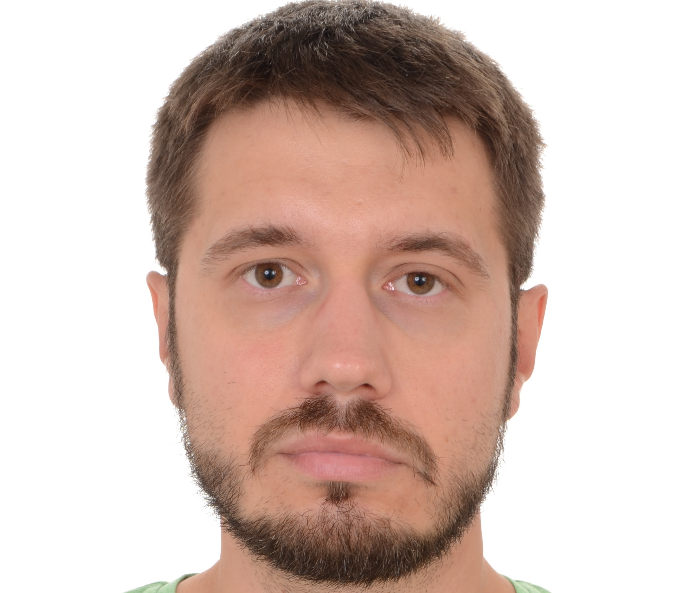

===
CV
===

**Denis Mashutin**

Phone **+7 910 615 25 75**	

E-mail **properevod@gmail.com**

Location: **Moscow**

Skills and Attributes
---------------------

*  Near native spoken and written English

*  Software development environment: Git, Azure DevOps, TFS, Confluence

*  Experience writing SDK and API documentation

*  Docs-as-code workflow: Markdown, Sphinx, pandoc

*  Advanced spoken and written Arabic

*  XML-based authoring tools

*  Python (NumPy, Tkinter, OOP, multiprocessing)

*  Bash scripting

*  Experience with virtualization (VMware, VirtualBox)

*  Basic SQL

*  Advanced Arabic

Positions and Tasks
----------------------------

*  **2021—now—Technical Writing Lead @ CMA Small Systems AB**

   *  Advocating and driving the transition to 'docs-as-code' approach

   *  Creating and maintaining the documentation repository

   *  Mentoring and training technical writers

*  **2020—2021—Senior Technical Writer @ Kaspersky**
	
   *  Created and maintained documentation for SDK and B2B products

   *  Developed Python scripts and tools for internal use

   *  Provided technical support to the users of internal tools

*  **2019—2020—Head of Documentation & Translation Dept @ STG Engineering**

   *  Controlled the quality of technical documentation and translations

   *  Maintained technical documentation for equipment, plants, oil & gas wells

   *  Translated laws and technical standards

*  **2013—2018—Technical Translator @ Team of military engineers in UAE**

   *  Developed a custom system for processing spare parts orders

   *  Wrote user manuals for that system

   *  Kept track of provided services, managed everyday issues

*  **2008—2013—Translator @ Higher Military School in Algeria**

   *  Provided translation during classes

   *  Translated PowerPoint presentations

Education
---------
2008 – The Military University of the Russian Ministry of Defence with a major in foreign languages

For the full list of courses and certifications, please visit my `LinkedIn profile <https://www.linkedin.com/in/denis-mashutin/>`_.